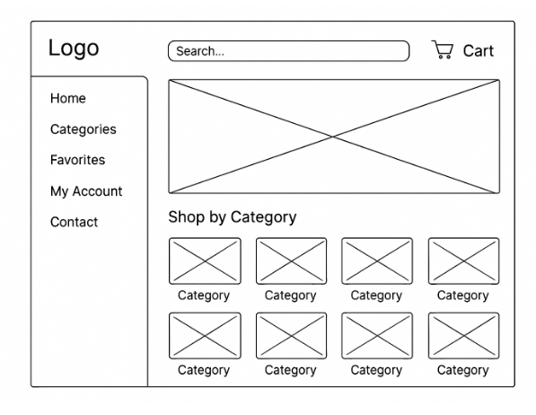
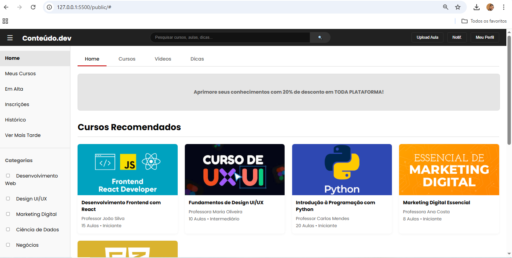
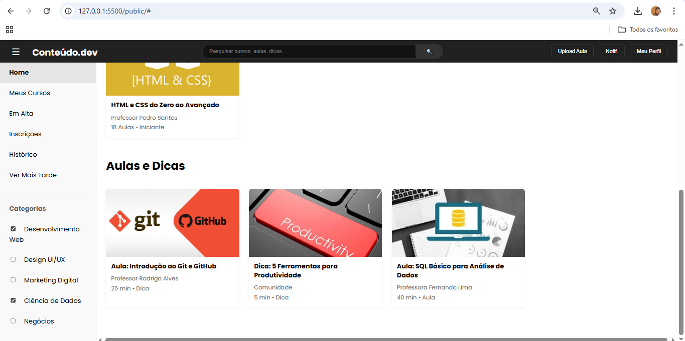

# Trabalho Prático - Semana 03

Dessa vez, vamos escolher uma proposta de projeto para trabalhar.

Nessa atividade, você deverá montar a página inicial do projeto escolhido, a organização do HTML aplicando semântica correta e uso aprimorado do CSS. Leia o enunciado completo no Canvas para mais detalhes.

**IMPORTANTE:** Você deve trabalhar e alterar apenas arquivos dentro da pasta **`public`**. Deixe todos os demais arquivos e pastas desse repositório inalterados. **PRESTE MUITA ATENÇÃO NISSO.**

## Informações Gerais

- Nome: Victor Gabriel Soares Ananias
- Matricula: 903685
- Proposta de projeto escolhida: 5. Temas e Conteúdos Associados" com tema de Tema e vídeos, curso e aulas, categoria e dicas
- Breve descrição sobre seu projeto:
Meu projeto é uma platafora de ensino, contendo nela cursos, videos e dícas. Com foco principal em assuntos ligados a tecnologia, desenvolvimento, marketing, etc...

## Print do(s) wireframe(s) criado

## Print da home-page criada

